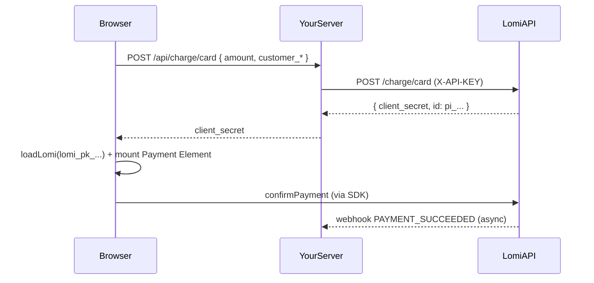

# lomi Direct Charge Integration Reference

Minimal Node + Express example for **direct charges** (`POST /charge/*`) without hosted checkout sessions. Card payments use **`@lomi./sdk` Payment Elements** on the client; Wave and MTN are server-only API calls. Includes cURL scripts.

For hosted checkout sessions, see [`../payment-integration-sdk-reference`](../payment-integration-sdk-reference).

## What is included

| Flow | Server route | lomi API |
| --- | --- | --- |
| Wave mobile money | `POST /api/charge/wave` | `POST /charge/wave` |
| MTN MoMo | `POST /api/charge/mtn` | `POST /charge/mtn` |
| Embedded card | `POST /api/charge/card` | `POST /charge/card` |
| Card status | `GET /api/charge/card/:id` | `GET /charge/card/{id}` |
| Cancel card charge | `POST /api/charge/card/:id/cancel` | `POST /charge/card/{id}/cancel` |
| Webhooks | `POST /api/webhooks/lomi` | Dashboard → your URL |

## Quick start

From `direct-charge-integration-reference/`:

```bash
pnpm install
cp .env.example .env
# Edit .env with your sandbox secret key + lomi publishable key
pnpm run dev
```

Open `http://localhost:3002`.

## Required env vars

```env
LOMI_BASE_URL=https://sandbox.api.lomi.africa
LOMI_API_KEY=lomi_sk_test_...
LOMI_PUBLISHABLE_KEY=lomi_pk_test_...
LOMI_WEBHOOK_SECRET=whsec_...
```

- **`LOMI_API_KEY`** — secret key, server-side only (`X-API-KEY` header).
- **`LOMI_PUBLISHABLE_KEY`** — publishable key for `@lomi./sdk` on the client (`lomi_pk_...`). Also accepts `LOMI_PUBLIC_KEY`.
- Use **sandbox** URLs and **test** keys while integrating.

## Card charge flow (end-to-end)



### Reconciliation requirements

`POST /charge/card` requires **either**:

- `customer_id` (UUID v4), **or**
- `customer_email` **and** `customer_name` together

Without this, lomi cannot tie the payment intent to an internal customer/transaction.

## cURL examples

```bash
chmod +x curl/*.sh

LOMI_BASE_URL=https://sandbox.api.lomi.africa \
LOMI_API_KEY=lomi_sk_test_... \
./curl/create-wave-charge.sh

LOMI_API_KEY=lomi_sk_test_... ./curl/create-mtn-charge.sh

LOMI_API_KEY=lomi_sk_test_... ./curl/create-card-charge.sh

PAYMENT_INTENT_ID=pi_... LOMI_API_KEY=lomi_sk_test_... ./curl/get-card-charge.sh
```

Or hit this demo server's proxy routes (after `pnpm run dev`):

```bash
./curl/create-card-charge-via-demo-server.sh
```

## Production notes

- Keep `LOMI_API_KEY` server-side only.
- Treat `client_secret` as a short-lived capability — never log it or expose it in URLs.
- Confirm final payment state via **webhooks** or `GET /charge/card/{id}`.
- Wave/MTN responses are **async** — show pending UI until webhook or status poll.

## Related docs

- [Direct charges guide](https://docs.lomi.africa/build/payments/charges)
- [Create card charge API](https://docs.lomi.africa/api/charge/ChargesController_createCardCharge)
- [lomi Payment Elements](https://docs.lomi.africa/build/payments/lomi-payment-elements)
- [Sandbox test cards](https://docs.lomi.africa/start/sandbox-payments)
